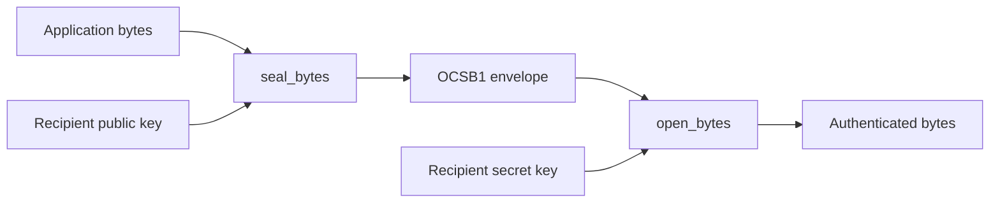

**Seal application bytes from Rust, Python, Java or C++.**

[](https://github.com/AlexiAxAxA/OpenCrateSDK/actions/workflows/ci.yml)
&nbsp; `Rust 1.96+` · `0.0.2 preview` · `one recipient`

Open Crate SDK is a small Rust layer over the published
[`oc-crypto`](https://crates.io/crates/oc-crypto) core. Give it JSON, a message,
or any other byte slice up to **16 MiB**. It returns an authenticated `OCSB1`
envelope that your application can store or send.

Use this package directly for the small API, or enable `app-data` on
[`opencrate`](https://crates.io/crates/opencrate) to reach the same API as
`opencrate::app_data` alongside the five low-level core libraries.

## Choose your language

| Language | How to start |
| --- | --- |
| Rust | Add `opencrate-sdk = "=0.0.2"` to `Cargo.toml`; [run the example](#try-it-in-30-seconds) or [copy the API example](#use-it-in-your-app). |
| Python | Build `ffi/` with `cargo build --manifest-path ffi/Cargo.toml --locked`, then use the [`ctypes` wrapper and example](docs/foreign-languages.md#python). |
| Java 22+ | Build `ffi/`, then run the [FFM example](docs/foreign-languages.md#java); no JNI or external JAR is required. |
| C++ | Build `ffi/`, include `ffi/include/opencrate_ffi.h`, and follow the [linking example](docs/foreign-languages.md#c). |

These paths seal and open the SDK's `OCSB1` byte envelope. To inspect the
**`.cc` document container**, use the separate [Open Crate core](https://github.com/AlexiAxAxA/OpenCrate):
[getting started](https://github.com/AlexiAxAxA/OpenCrate/blob/main/docs/getting-started.md),
[container format](https://github.com/AlexiAxAxA/OpenCrate/blob/main/docs/format.md),
and [runnable examples](https://github.com/AlexiAxAxA/OpenCrate/blob/main/examples/README.md).
The foreign-language bindings do not expose `.cc` operations.

> [!IMPORTANT]
> Version `0.0.2` is a **preview**. The API and `OCSB1` envelope have no stable
> compatibility promise or independent security audit. Protect recipient keys
> and review the [security boundary](https://github.com/AlexiAxAxA/OpenCrateSDK/blob/main/docs/security-review.md)
> before storing data you need to keep.

| Start here | Go deeper |
| --- | --- |
| [Run the example](#try-it-in-30-seconds) · [Add it to an app](#use-it-in-your-app) | [Integration guide with diagrams](https://github.com/AlexiAxAxA/OpenCrateSDK/blob/main/docs/usage-guide.md) · [Architecture](https://github.com/AlexiAxAxA/OpenCrateSDK/blob/main/docs/architecture.md) · [Security review](https://github.com/AlexiAxAxA/OpenCrateSDK/blob/main/docs/security-review.md) |

The [foreign-language guide](docs/foreign-languages.md) explains the
experimental C ABI, library paths, buffers, and key handling.

## Try it in 30 seconds

With [Rust installed](https://www.rust-lang.org/tools/install):

```sh
git clone https://github.com/AlexiAxAxA/OpenCrateSDK.git
cd OpenCrateSDK
cargo run --locked --example json-message
```

The [example](https://github.com/AlexiAxAxA/OpenCrateSDK/blob/main/examples/json-message.rs) seals JSON-shaped bytes for a temporary
recipient key, opens them, and verifies the result. To run the checks locally:

```sh
cargo test --locked
cargo clippy --locked --all-targets -- -D warnings
```

## Use it in your app

Add the preview release to your `Cargo.toml`:

```toml
[dependencies]
opencrate-sdk = "=0.0.2"
```

```rust
use opencrate_sdk::{generate_recipient, open_bytes, recipient_public, seal_bytes};

fn main() -> Result<(), Box<dyn std::error::Error>> {
    let secret = generate_recipient()?;
    let public = recipient_public(&secret);
    let purpose = "com.example.invoice.v1";
    let context = b"tenant-7:invoice-42";

    let envelope = seal_bytes(&public, purpose, context, br#"{"total":42}"#)?;
    let plaintext = open_bytes(&secret, purpose, context, &envelope)?;
    assert_eq!(&*plaintext, br#"{"total":42}"#);
    Ok(())
}
```

This example keeps the key in memory to show the API. A real application must
protect and reload its recipient secret, authenticate the public key before
senders use it, and store the envelope. It must also supply the **same**
`purpose` and `context` when opening; neither value is included in `OCSB1`.
See the [step-by-step integration guide](https://github.com/AlexiAxAxA/OpenCrateSDK/blob/main/docs/usage-guide.md) before storing
data you will need to open later.

## What the SDK handles



| SDK provides | Your application provides |
| --- | --- |
| OS-backed recipient key generation | Secure key storage, backup, and authentic public-key distribution |
| X25519 sealing through `oc-crypto` | Storage and transport of the envelope |
| Authenticated `purpose` and `context` binding | Stable purpose and context values on both sides |
| A bounded envelope and zeroizing returned plaintext | Authorization, access policy, and any revocation workflow |

`OCSB1` is a sealed-data envelope, **not** the `CLOSECR1` `.cc` document format.
It has one recipient and no author signature, lease, policy evaluation, or
revocation. For document containers and lower-level building blocks, see the
[Open Crate core](https://github.com/AlexiAxAxA/OpenCrate).

## Documentation

- [Integration guide](https://github.com/AlexiAxAxA/OpenCrateSDK/blob/main/docs/usage-guide.md) — diagrams, key flow, API calls,
  persistence checklist, and errors.
- [Python, Java and C++](docs/foreign-languages.md) — native build and language examples.
- [`.cc` container documentation](https://github.com/AlexiAxAxA/OpenCrate/blob/main/docs/index.md) — the separate core format and examples.
- [Architecture](https://github.com/AlexiAxAxA/OpenCrateSDK/blob/main/docs/architecture.md) — component boundary and `OCSB1` layout.
- [Security review](https://github.com/AlexiAxAxA/OpenCrateSDK/blob/main/docs/security-review.md) — checks performed and work needed
  before a stable release.

## License

The [Open Crate Community License 1.0](https://github.com/AlexiAxAxA/OpenCrateSDK/blob/main/LICENSE-OPENCRATE) applies to this SDK
and its Open Crate core dependency. Read its complete terms before use.
