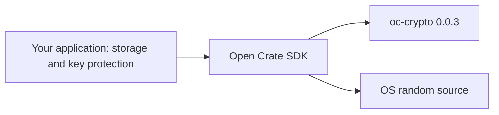

# Architecture

For a step-by-step application flow and key lifecycle, see the
[integration guide](usage-guide.md).

The SDK is a separate application-layer project. It depends on the published
`oc-crypto = 0.0.3` package; it does not copy core source or depend on the
private Close Crate product.

The optional `ffi/` shared library sits above the SDK for Python, Java and
C++ callers. It is a separate package because only this boundary handles raw
foreign pointers; neither `opencrate-sdk` nor `oc-crypto` gains unsafe code.
Its ABI v1 exposes the SDK's sealed-byte operations, not `.cc` orchestration.

The SDK generates a recipient secret, derives its public key, and offers
`seal_bytes`/`open_bytes`. It uses the core's X25519 sealing operation and
XChaCha20-Poly1305 authentication. It provides a bounded, versioned byte
envelope and an OS entropy adapter. The core remains responsible for the
cryptographic operation; the SDK does not fork or reimplement that algorithm.

`OCSB1` is independent of the `CLOSECR1` `.cc` container. It has a five-byte
ASCII magic, a 32-byte ephemeral X25519 public key, a 24-byte nonce, and a
ciphertext with a 16-byte tag. The SDK's domain separator and a length-prefixed
application `purpose` feed the key derivation. Caller-supplied `context` is
authenticated as associated data. The maximum plaintext size is 16 MiB.

The application owns persistent key storage, authentic distribution of public
keys, storage and transport of envelopes, and any access rules. Encryption
alone cannot revoke a recipient's already obtained plaintext. This API has one
recipient and no signature, lease, revocation, password path or policy
evaluation. The SDK has no viewer or server dependency.
