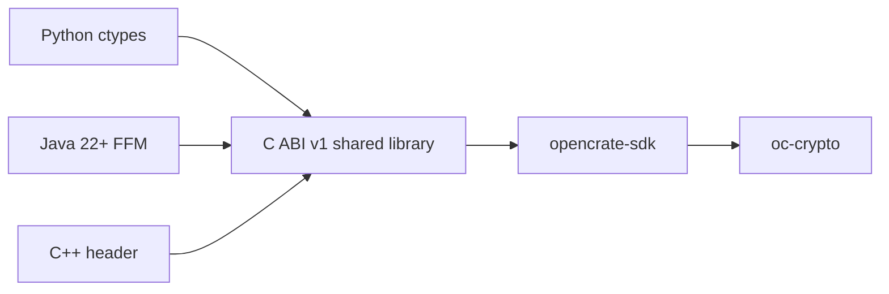

# Calling sealed bytes from Python, Java and C++

[SDK home](../README.md) · [Architecture](architecture.md) · [Security review](security-review.md)

The `ffi/` package builds an **experimental ABI v1** shared library around
`opencrate-sdk`. It exposes recipient generation, public-key derivation,
`seal_bytes`, and `open_bytes`. The byte envelope is still `OCSB1`, with one
recipient and the SDK's 16 MiB plaintext limit. This does not expose the `.cc`
container, lease, policy or revocation APIs.



## Build

Install Rust 1.96 or use the pinned toolchain, then run from this repository:

```sh
cargo build --manifest-path ffi/Cargo.toml --locked
```

The result is `ffi/target/debug/opencrate_ffi.dll` on Windows,
`ffi/target/debug/libopencrate_ffi.so` on Linux, or
`ffi/target/debug/libopencrate_ffi.dylib` on macOS. This repository currently
checks Windows and Linux; macOS is not yet a CI target. Set
`OPENCRATE_FFI_LIB` to the absolute library path for the Python and Java
examples. Use a build for the same operating system and architecture as the
calling process. ABI v1 assumes a 64-bit process (`size_t` maps to 64 bits).

## Python

No PyPI package or third-party Python library is needed. The example uses
standard-library `ctypes`:

```sh
python bindings/python/smoke.py
```

Import `OpenCrateBytes` from `bindings/python/opencrate_bytes.py` in your
application. `generate_recipient()` returns a context-managed `Recipient`;
calling `close()` clears this wrapper's secret buffer. Plaintext returned as
Python `bytes`, and any copied secret, remain the application's responsibility.
`recipient_from_secret()` supports reopening after a restart; `export_secret()`
creates an immutable Python copy that the runtime cannot reliably erase. Store
it only through an appropriate protected key mechanism.

## Java

Use JDK 22 or newer; the example uses the standard Foreign Function & Memory
API with no JNI or external JAR. On JDK 23:

```sh
javac bindings/java/OpenCrateBytesSmoke.java
java --enable-native-access=ALL-UNNAMED -cp bindings/java OpenCrateBytesSmoke
```

The example places the recipient secret in native memory and clears it before
closing its arena. Protect persistent keys with an application key store.

## C++

Include [`ffi/include/opencrate_ffi.h`](../ffi/include/opencrate_ffi.h) and link
against the built shared library. A Linux example:

```sh
g++ -std=c++17 -I ffi/include bindings/cpp/smoke.cpp \
  -L ffi/target/debug -lopencrate_ffi -o ffi/target/cpp-smoke
LD_LIBRARY_PATH=ffi/target/debug ffi/target/cpp-smoke
```

On Windows, use the generated `opencrate_ffi.dll.lib` import library and keep
`opencrate_ffi.dll` on the loader path. The C ABI header also works from C.

## ABI and buffer rules

- Call `ocb_abi_version()` and require `1` before any other call.
- All byte strings have explicit lengths; `purpose` is UTF-8 and has 1–128
  bytes. `context` is at most 64 KiB. A zero-length byte string may use `NULL`.
- `ocb_generate_recipient` writes a 32-byte secret and a 32-byte public key.
  The caller owns and protects both; only the secret must stay private.
- `ocb_seal` and `ocb_open` write into caller-owned output buffers. Pass `NULL`
  with zero output capacity to query the needed size. A size query does not
  encrypt or authenticate; only status `OCB_OK` validates the output.
- `written` is a separate writable `size_t`. On `OCB_OUTPUT_TOO_SMALL` it gives
  the required capacity. On other errors it is zero when the pointer itself is
  valid. The output buffer is untouched on error.
- A non-null pointer must refer to at least its declared size of accessible
  memory. An invalid native pointer cannot be made safe by the library. Keys
  must point to 32 bytes. The fixed key input/output buffers must not overlap.
- Status `OCB_CRYPTO` intentionally groups authentication and key failures.
  Do not expose a more detailed authentication oracle to callers.

The ABI copies input bytes before writing output and catches Rust panics at
the FFI boundary. It does not own or wipe caller buffers. This is a preview:
review key storage, library loading, exception handling and memory ownership
for your application before using it with long-lived data.
