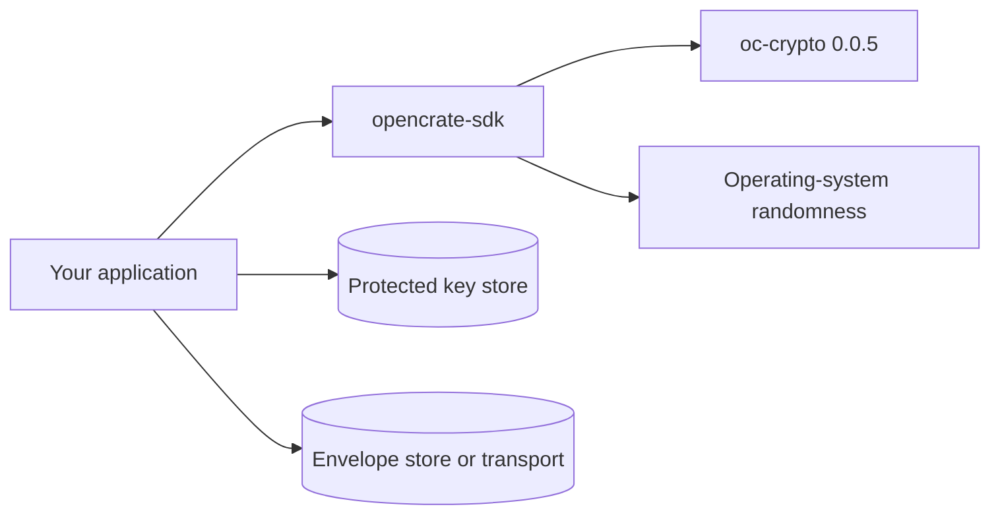
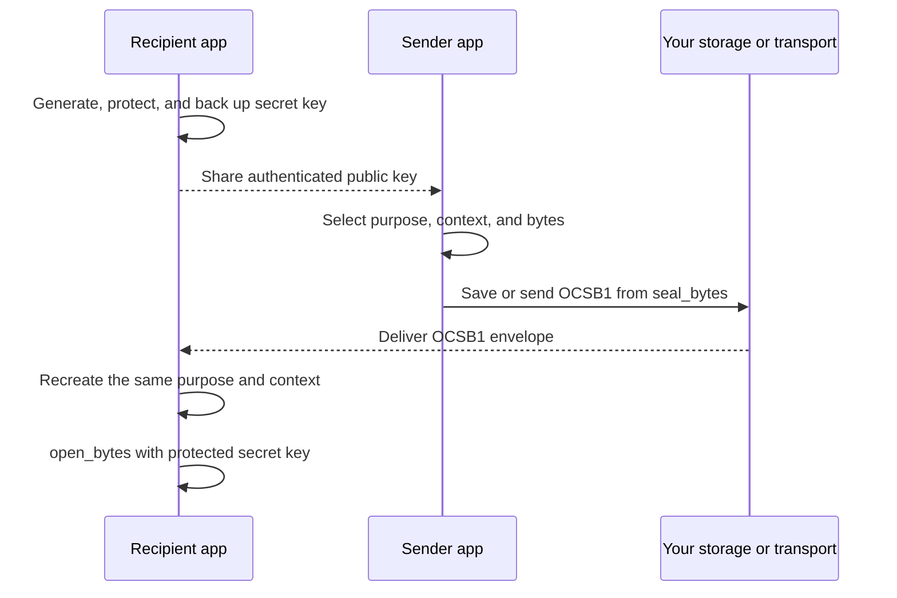
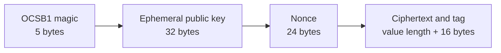

# Integration guide

This guide shows how to use the **0.0.5 preview** of Open Crate SDK for small
application values. It covers one X25519 recipient and byte slices up to
**16 MiB**. The SDK is not a storage service or an access-control system.

## 1. Choose the right layer

| Goal | Starting point |
| --- | --- |
| Seal JSON, a message, or another small byte value for one recipient | This SDK: `seal_bytes` and `open_bytes` |
| Build your own format or protocol from lower-level primitives | [Open Crate core](https://github.com/AlexiAxAxA/OpenCrate) |
| Work with the signed, policy-controlled `.cc` document format | Open Crate's `.cc` components; `OCSB1` is a different format |

The dependency direction is deliberately small:



The SDK does not own the two stores. `oc-crypto` performs the cryptographic
operation; the SDK supplies the OS random source and `OCSB1` framing.

## 2. Add the dependency

Pin the preview version from crates.io so a future release does not silently
change your build:

```toml
[dependencies]
opencrate-sdk = "=0.0.5"
```

The SDK requires Rust 1.96 or newer. You can instead clone this repository and
use a local `path` dependency while developing.

## 3. Establish the recipient key

The receiving application calls `generate_recipient()` once for a recipient,
protects and backs up the resulting `X25519Secret`, then derives the public key
with `recipient_public(&secret)`. Senders need an **authentic** copy of that
public key. The SDK does not verify who owns a supplied key.

The example in [`examples/json-message.rs`](../examples/json-message.rs)
generates a temporary key for a single process. Do not copy that lifecycle for
persistent data: losing the secret makes stored envelopes unreadable. Key
import/export is explicit through `X25519Secret::from_bytes` and `expose`; your
application must choose and secure the storage adapter.



## 4. Bind and seal the value

`purpose` separates application uses, for example
`"com.example.invoice.v1"`. It must be nonempty and at most 128 UTF-8 bytes.
`context` binds the envelope to an object or tenant; an empty context is
allowed when no binding is needed. Choose an unambiguous encoding for context
and keep it stable. Neither value is stored in the envelope.

```rust
let purpose = "com.example.invoice.v1";
let context = b"tenant-7:invoice-42";
let payload = br#"{"total":42}"#;
let envelope = seal_bytes(&recipient_public(&secret), purpose, context, payload)?;
// Persist or send `envelope` with the metadata needed to recreate purpose/context.
```

The sender can use the recipient's authenticated public key without having the
secret. The snippet above uses `secret` only to make a compact local example.
For a separate sender, pass the public key it received from the recipient.

## 5. Open the envelope

```rust
let plaintext = open_bytes(&secret, purpose, context, &envelope)?;
// `plaintext` is a zeroizing buffer; use it, then let it drop.
```

Opening fails if the key, purpose, context, or encrypted bytes differ. Persist
enough application metadata to reproduce purpose and context exactly. Do not
log plaintext or the recipient secret.

### What to keep

| Item | Where it belongs | Why |
| --- | --- | --- |
| Recipient secret | Protected application key store and backup | Required to open later; never inside the envelope |
| Recipient public key | Authenticated key directory or configuration | Required by senders; identity is checked by your application |
| `OCSB1` envelope | Your database, file, queue, or transport | Contains the sealed value |
| Purpose and context | Stable application metadata or deterministic rules | Must be reproduced unchanged to open |

## Envelope and failure boundaries



The framing above describes this preview only; it is not a compatibility
promise. The format is separate from a `.cc` file. `purpose` participates in
key derivation and `context` is authenticated as associated data.

| Error | Typical cause |
| --- | --- |
| `InvalidPurpose` | Empty purpose or more than 128 UTF-8 bytes |
| `TooLarge` | Plaintext or envelope exceeds the 16 MiB data limit |
| `InvalidEnvelope` | Missing or malformed `OCSB1` framing |
| `Entropy` | Operating-system randomness unavailable |
| `Crypto` | Invalid recipient key or authentication failure |

The SDK does not issue leases, enforce permissions, revoke previously shared
plaintext, sign authorship, or encrypt for multiple recipients. For the exact
implementation boundary, see [architecture](architecture.md). For verified
checks and remaining review work, see [security review](security-review.md).
